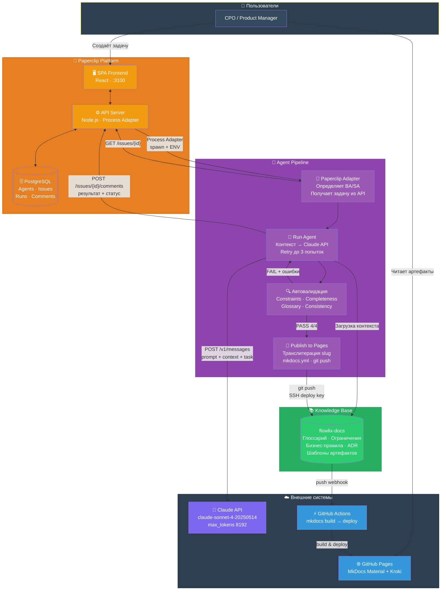
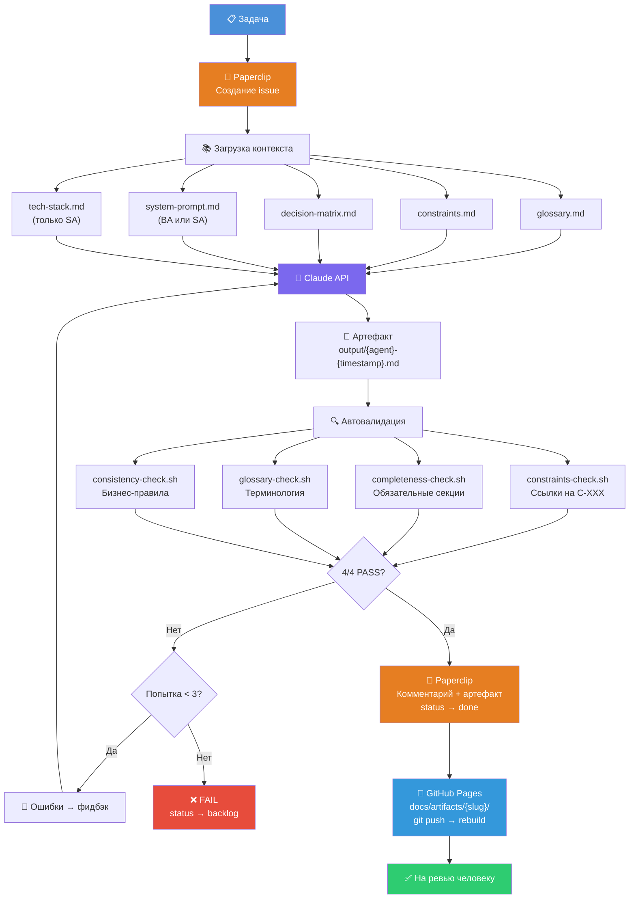

# AI-native инфраструктура документации для BA/SA агентов платёжной B2B процессинговой платформы

**GitHub Pages:** [anurgaz.github.io/ba-sa-paperclip-agents](https://anurgaz.github.io/ba-sa-paperclip-agents/)
**Paperclip UI:** [159.69.28.60:3100](http://159.69.28.60:3100)

---

## Architecture Overview



## Pipeline Flow



---

## Структура репозитория

```
flowlix-docs/
├── docs/                   # Документация и контекст
│   ├── context/            # Глоссарий, ограничения, decision matrix, tech stack
│   ├── adr/                # Architecture Decision Records
│   ├── business-rules/     # Бизнес-правила (онбординг, транзакции, споры, AML)
│   ├── data/               # Data dictionary, SLA metrics, KPI
│   ├── integrations/       # Интеграции (Visa/MC, KYC, TMS)
│   ├── artifact-templates/ # Шаблоны артефактов (User Story, API Spec, etc.)
│   ├── examples/           # Эталонные примеры (few-shot)
│   └── artifacts/          # Сгенерированные артефакты по фичам
├── agents/                 # Профили и system prompts агентов
│   ├── ba-agent/           # Business Analyst агент
│   └── sa-agent/           # System Analyst агент
├── validation/             # Скрипты автовалидации (4 проверки)
├── pipeline/               # Pipeline: run-agent, adapter, publish
└── .github/workflows/      # CI/CD (GitHub Pages deploy)
```

## Компоненты

### Paperclip Platform

| Компонент | Технология | Описание |
|-----------|-----------|----------|
| SPA Frontend | React | UI для управления агентами, задачами, логами |
| API Server | Node.js / Express | REST API, Process Adapter, Heartbeat, Auth |
| Database | PostgreSQL | Agents, Issues, Runs, Comments, API Keys |

### Agent Pipeline

| Скрипт | Описание |
|--------|----------|
| `pipeline/paperclip-adapter.sh` | Принимает задачу от Paperclip Process Adapter, определяет BA/SA |
| `pipeline/run-agent.sh` | Загружает контекст, Claude API, валидация, retry до 3 раз |
| `pipeline/publish-to-pages.sh` | Публикация артефакта в GitHub Pages (транслитерация, mkdocs.yml) |
| `validation/validate.sh` | Оркестратор 4 проверок валидации |

### Автовалидация (4 проверки)

| Проверка | Файл | Что проверяет |
|----------|------|---------------|
| Constraints | `constraints-check.sh` | Ссылки на C-XXX из constraints.md |
| Completeness | `completeness-check.sh` | Обязательные секции для типа артефакта |
| Glossary | `glossary-check.sh` | Использование терминов из глоссария |
| Consistency | `consistency-check.sh` | Ссылки на BR-XXX бизнес-правила |

### Внешние системы

| Система | Роль |
|---------|------|
| Claude API | `claude-sonnet-4-20250514`, Messages API, max_tokens 8192 |
| GitHub Actions | CI/CD: `mkdocs build --strict` → GitHub Pages deploy |
| GitHub Pages | MkDocs Material + Kroki (PlantUML rendering) |

## Быстрый старт

### Через Paperclip UI (рекомендуется)

1. Открыть [Paperclip UI](http://159.69.28.60:3100)
2. Создать задачу и назначить на BA Agent или SA Agent
3. Агент автоматически выполнит pipeline
4. Результат: комментарий в задаче + публикация в [GitHub Pages](https://anurgaz.github.io/ba-sa-paperclip-agents/)

### Через CLI

```bash
# BA Agent — User Story
./pipeline/run-agent.sh \
  --agent ba \
  --task "Создай user story для онбординга нового мерчанта через API"

# SA Agent — API Specification
./pipeline/run-agent.sh \
  --agent sa \
  --task "Создай API спецификацию для POST /api/v1/merchants"

# Валидация артефакта
./validation/validate.sh output/ba-20260309-120000.md
```

## Decision Matrix

| Действие | Уровень | Апрувер |
|----------|---------|---------|
| User Story | suggest+approve | PO |
| API Spec | suggest+approve | Tech Lead |
| Test Cases | auto | — |
| Business Rules | manual only | PO + Compliance |
| AML/Compliance | manual only | MLRO |
