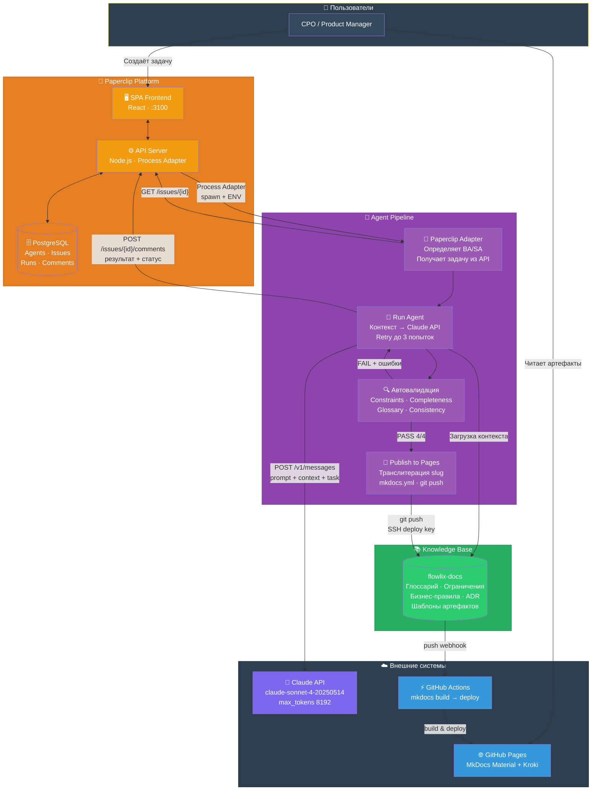
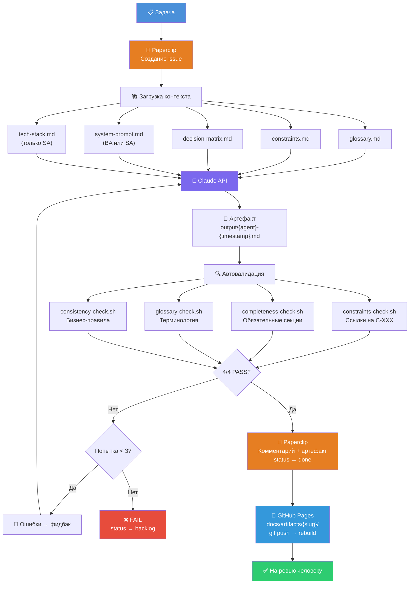

# Архитектура платформы

## Architecture Overview

Верхнеуровневая диаграмма компонентов системы и связей между ними.



---

## Pipeline Flow

Детальный процесс обработки задачи — от создания до ревью человеком.



---

## C4 Container Diagram

Формальная C4-диаграмма в нотации PlantUML — все контейнеры, базы данных и внешние системы.

```kroki-plantuml
@startuml Flowlix Agent Platform — C4 Container Diagram
!include https://raw.githubusercontent.com/plantuml-stdlib/C4-PlantUML/master/C4_Container.puml
!include https://raw.githubusercontent.com/plantuml-stdlib/C4-PlantUML/master/C4_Component.puml

LAYOUT_WITH_LEGEND()
LAYOUT_LEFT_RIGHT()

title Flowlix Agent Platform — C4 Container Diagram

Person(cpo, "CPO / Product Manager", "Создаёт задачи для агентов,\nревьюит артефакты")

System_Boundary(paperclip, "Paperclip Platform") {
    Container(spa, "SPA Frontend", "React", "UI для управления агентами,\nзадачами, просмотра логов")
    Container(api, "API Server", "Node.js / Express", "REST API, Process Adapter,\nHeartbeat, Auth")
    ContainerDb(db, "Database", "PostgreSQL", "Agents, Issues, Runs,\nComments, API Keys")
}

System_Boundary(pipeline, "Agent Pipeline") {
    Container(adapter, "Paperclip Adapter", "Bash", "Принимает задачу от Process Adapter,\nопределяет агента (BA/SA),\nполучает описание задачи из API")
    Container(runner, "Run Agent", "Bash", "Загружает контекст,\nвызывает Claude API,\nуправляет retry-циклом (до 3 попыток)")
    Container(validator, "Автовалидация", "Bash", "4 проверки:\n— Constraints (C-XXX)\n— Completeness\n— Glossary\n— Consistency (BR-XXX)")
    Container(publisher, "Publish to Pages", "Bash + Python", "Транслитерация slug,\nобновление mkdocs.yml,\ngit commit & push")
}

System_Boundary(context, "Knowledge Base") {
    ContainerDb(docs_repo, "flowlix-docs", "Git Repository", "Глоссарий, ограничения,\nбизнес-правила, ADR,\nшаблоны артефактов")
}

System_Ext(claude, "Claude API", "Anthropic claude-sonnet-4-20250514\nMessages API, max_tokens 8192")
System_Ext(github_pages, "GitHub Pages", "MkDocs Material + Kroki\nПубличная документация")
System_Ext(github_actions, "GitHub Actions", "CI/CD: mkdocs build → deploy")

Rel(cpo, spa, "Создаёт задачу", "HTTPS")
Rel(spa, api, "REST API calls", "HTTP :3100")
Rel(api, db, "CRUD", "TCP :5432")

Rel(api, adapter, "Process Adapter\nspawn child process", "ENV: PAPERCLIP_AGENT_ID,\nPAPERCLIP_ISSUE_ID")
Rel(adapter, api, "GET /issues/{id}\nполучает описание задачи", "HTTP + API Key")
Rel(adapter, runner, "Запускает pipeline", "ENV: AGENT, TASK,\nPAPERCLIP_ISSUE_ID")

Rel(runner, docs_repo, "Загружает контекст", "glossary, constraints,\nbusiness-rules, templates")
Rel(runner, claude, "POST /v1/messages\nSystem prompt + Context + Task", "HTTPS + API Key")
Rel(runner, validator, "Передаёт артефакт\nна валидацию", "stdout/file")
Rel_Back(validator, runner, "PASS/FAIL + ошибки\n(retry если FAIL)", "exit code + stderr")

Rel(runner, api, "POST /issues/{id}/comments\nрезультат + статус", "HTTP + API Key")
Rel(runner, publisher, "Передаёт валидный\nартефакт (.md)", "file path")

Rel(publisher, docs_repo, "git add, commit, push", "SSH (deploy key)")
Rel(docs_repo, github_actions, "push event trigger", "webhook")
Rel(github_actions, github_pages, "mkdocs build → deploy", "HTTPS")

Rel(cpo, github_pages, "Читает документацию\nи артефакты", "HTTPS")
Rel(cpo, spa, "Ревьюит результат\nв комментариях", "HTTPS")

@enduml
```

---

## Компоненты

### Paperclip Platform

| Компонент | Технология | Описание |
|-----------|-----------|----------|
| SPA Frontend | React | UI для управления агентами, задачами, просмотра логов |
| API Server | Node.js / Express | REST API, Process Adapter, Heartbeat, Auth |
| Database | PostgreSQL | Agents, Issues, Runs, Comments, API Keys |

### Agent Pipeline

| Компонент | Технология | Описание |
|-----------|-----------|----------|
| Paperclip Adapter | Bash | Принимает задачу от Process Adapter, определяет агента BA/SA |
| Run Agent | Bash | Загружает контекст, вызывает Claude API, retry до 3 раз |
| Автовалидация | Bash | 4 проверки: Constraints, Completeness, Glossary, Consistency |
| Publish to Pages | Bash + Python | Транслитерация slug, обновление mkdocs.yml, git push |

### Knowledge Base

| Артефакт | Назначение |
|----------|-----------|
| glossary.md | Единый глоссарий терминов (рус/англ) |
| constraints.md | Ограничения C-001...C-030 (PCI DSS, PSD2, AML) |
| decision-matrix.md | Матрица полномочий агентов |
| business-rules/ | Бизнес-правила BR-XXX по доменам |
| artifact-templates/ | Шаблоны User Story, API Spec, Sequence Diagram, Test Case |

### Внешние системы

| Система | Роль |
|---------|------|
| Claude API | LLM claude-sonnet-4-20250514, max_tokens 8192 |
| GitHub Actions | CI/CD: `mkdocs build --strict` → GitHub Pages deploy |
| GitHub Pages | Публичная документация MkDocs Material + Kroki |
