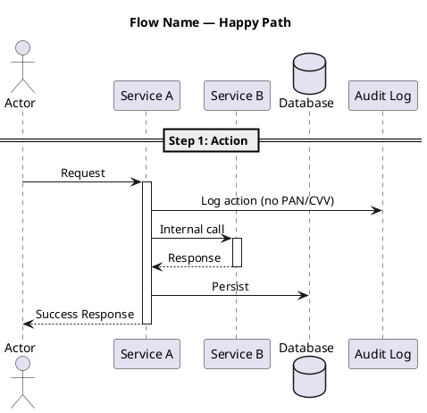
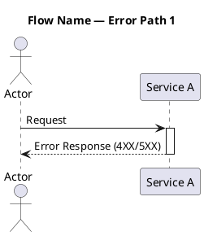
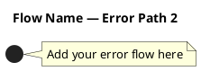

# Sequence Diagram Template

> Шаблон для SA агента. Каждая sequence диаграмма — PlantUML формат.

---

## [SEQ-XXX] Название flow

### Metadata
- **Author:** [SA Agent / Human]
- **Status:** [DRAFT] / [APPROVED]
- **Related:** US-XXX, API-XXX

### Description
Краткое описание flow.

### Happy Path

### Error Path 1: [Описание ошибки]

### Error Path 2: [Описание ошибки]

### Notes
- Граничные случаи и assumptions
- Ссылки на constraints: C-XXX

---

## Инструкция для агента

1. **ОБЯЗАТЕЛЬНО:** happy path + минимум 2 error paths
2. Формат: PlantUML (@startuml / @enduml)
3. Audit log ВСЕГДА присутствует как участник (C-009)
4. PAN никогда не передаётся вне CDE boundary (C-002, C-010)
5. Показывайте timeout и retry логику
6. Используйте activate/deactivate для наглядности
7. Группируйте шаги с == Step N: Name ==
8. Для CDE boundary используйте box "CDE" #LightCoral
