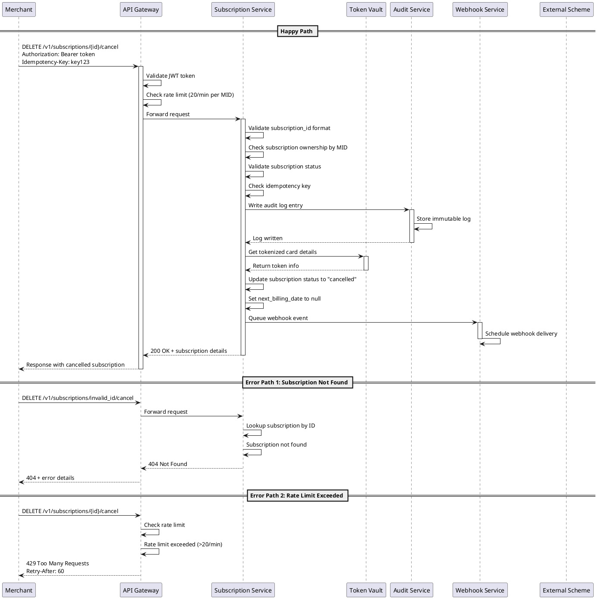
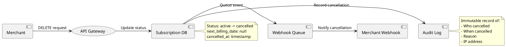

# [DRAFT] API –°–ø–µ—Ü–∏—Ñ–∏–∫–∞—Ü–∏—è: –û—Ç–º–µ–Ω–∞ –ø–æ–¥–ø–∏—Å–∫–∏ –Ω–∞ —Ä–µ–∫—É—Ä—Ä–µ–Ω—Ç–Ω—ã–µ –ø–ª–∞—Ç–µ–∂–∏

**ID:** SA-2026-003  
**–î–∞—Ç–∞:** 2026-03-09  
**–ê–≤—Ç–æ—Ä:** SA Agent  
**–°—Ç–∞—Ç—É—Å:** [DRAFT]  
**–¢–∏–ø:** API Specification  

## –û–±–∑–æ—Ä

API endpoint –¥–ª—è –æ—Ç–º–µ–Ω—ã –ø–æ–¥–ø–∏—Å–∫–∏ –Ω–∞ —Ä–µ–∫—É—Ä—Ä–µ–Ω—Ç–Ω—ã–µ –ø–ª–∞—Ç–µ–∂–∏. –ü–æ–∑–≤–æ–ª—è–µ—Ç –º–µ—Ä—á–∞–Ω—Ç—É –æ—Ç–º–µ–Ω–∏—Ç—å –∞–∫—Ç–∏–≤–Ω—É—é –ø–æ–¥–ø–∏—Å–∫—É, –ø—Ä–µ–∫—Ä–∞—Ç–∏–≤ –±—É–¥—É—â–∏–µ –∞–≤—Ç–æ–º–∞—Ç–∏—á–µ—Å–∫–∏–µ —Å–ø–∏—Å–∞–Ω–∏—è —Å –∫–∞—Ä—Ç—ã –¥–µ—Ä–∂–∞—Ç–µ–ª—è.

## User Story

**–ö–∞–∫** –º–µ—Ä—á–∞–Ω—Ç  
**–Ø —Ö–æ—á—É** –∏–º–µ—Ç—å –≤–æ–∑–º–æ–∂–Ω–æ—Å—Ç—å –æ—Ç–º–µ–Ω–∏—Ç—å –ø–æ–¥–ø–∏—Å–∫—É –∫–ª–∏–µ–Ω—Ç–∞ –Ω–∞ —Ä–µ–∫—É—Ä—Ä–µ–Ω—Ç–Ω—ã–µ –ø–ª–∞—Ç–µ–∂–∏  
**–ß—Ç–æ–±—ã** –ø—Ä–µ–∫—Ä–∞—Ç–∏—Ç—å –∞–≤—Ç–æ–º–∞—Ç–∏—á–µ—Å–∫–∏–µ —Å–ø–∏—Å–∞–Ω–∏—è –ø–æ –∑–∞–ø—Ä–æ—Å—É –∫–ª–∏–µ–Ω—Ç–∞ –∏–ª–∏ –ø—Ä–∏ –Ω–µ–æ–±—Ö–æ–¥–∏–º–æ—Å—Ç–∏

## Acceptance Criteria

### Happy Path
- ‚úÖ –ú–µ—Ä—á–∞–Ω—Ç –º–æ–∂–µ—Ç –æ—Ç–º–µ–Ω–∏—Ç—å –∞–∫—Ç–∏–≤–Ω—É—é –ø–æ–¥–ø–∏—Å–∫—É –ø–æ subscription_id
- ‚úÖ –ü–æ—Å–ª–µ –æ—Ç–º–µ–Ω—ã –≤—Å–µ –±—É–¥—É—â–∏–µ MIT —Ç—Ä–∞–Ω–∑–∞–∫—Ü–∏–∏ –ø—Ä–µ–∫—Ä–∞—â–∞—é—Ç—Å—è
- ‚úÖ –°—Ç–∞—Ç—É—Å –ø–æ–¥–ø–∏—Å–∫–∏ –º–µ–Ω—è–µ—Ç—Å—è –Ω–∞ "cancelled"
- ‚úÖ –û—Ç–ø—Ä–∞–≤–ª—è–µ—Ç—Å—è webhook —É–≤–µ–¥–æ–º–ª–µ–Ω–∏–µ –æ —Å—Ç–∞—Ç—É—Å–µ –ø–æ–¥–ø–∏—Å–∫–∏
- ‚úÖ –ó–∞–ø–∏—Å—ã–≤–∞–µ—Ç—Å—è audit log –∑–∞–ø–∏—Å—å –æ–± –æ—Ç–º–µ–Ω–µ

### Edge Cases
- ‚úÖ –û—Ç–º–µ–Ω–∞ —É–∂–µ –æ—Ç–º–µ–Ω–µ–Ω–Ω–æ–π –ø–æ–¥–ø–∏—Å–∫–∏ –≤–æ–∑–≤—Ä–∞—â–∞–µ—Ç —Ç–µ–∫—É—â–∏–π —Å—Ç–∞—Ç—É—Å –±–µ–∑ –æ—à–∏–±–∫–∏
- ‚úÖ –û—Ç–º–µ–Ω–∞ –ø–æ–¥–ø–∏—Å–∫–∏ —Å –∏—Å—Ç–µ–∫—à–∏–º —Å—Ä–æ–∫–æ–º –¥–µ–π—Å—Ç–≤–∏—è –æ–±—Ä–∞–±–∞—Ç—ã–≤–∞–µ—Ç—Å—è –∫–æ—Ä—Ä–µ–∫—Ç–Ω–æ
- ‚úÖ –ß–∞—Å—Ç–∏—á–Ω–∞—è –æ—Ç–º–µ–Ω–∞ –¥–ª—è multi-schedule –ø–æ–¥–ø–∏—Å–∫–∏ –Ω–µ –ø–æ–¥–¥–µ—Ä–∂–∏–≤–∞–µ—Ç—Å—è

### Error Scenarios
- ‚ùå –ü–æ–¥–ø–∏—Å–∫–∞ –Ω–µ –Ω–∞–π–¥–µ–Ω–∞ ‚Üí 404 Not Found
- ‚ùå –ü–æ–¥–ø–∏—Å–∫–∞ –ø—Ä–∏–Ω–∞–¥–ª–µ–∂–∏—Ç –¥—Ä—É–≥–æ–º—É –º–µ—Ä—á–∞–Ω—Ç—É ‚Üí 403 Forbidden
- ‚ùå –ù–µ–¥–µ–π—Å—Ç–≤–∏—Ç–µ–ª—å–Ω—ã–π —Ç–æ–∫–µ–Ω –∞–≤—Ç–æ—Ä–∏–∑–∞—Ü–∏–∏ ‚Üí 401 Unauthorized
- ‚ùå –ü—Ä–µ–≤—ã—à–µ–Ω rate limit ‚Üí 429 Too Many Requests

## API Specification

### Endpoint
```
DELETE /v1/subscriptions/{subscription_id}/cancel
```

### Authentication
```
Authorization: Bearer {jwt_token}
```

### Headers
```http
Content-Type: application/json
Idempotency-Key: {unique_key}  # –û–±—è–∑–∞—Ç–µ–ª–µ–Ω –¥–ª—è –¥–∞–Ω–Ω–æ–π –æ–ø–µ—Ä–∞—Ü–∏–∏
```

### Path Parameters
| Parameter | Type | Required | Description |
|-----------|------|----------|-------------|
| subscription_id | string | Yes | –£–Ω–∏–∫–∞–ª—å–Ω—ã–π –∏–¥–µ–Ω—Ç–∏—Ñ–∏–∫–∞—Ç–æ—Ä –ø–æ–¥–ø–∏—Å–∫–∏ (UUID format) |

### Request Body
```json
{
  "reason": "customer_request",
  "effective_date": "2026-03-15T00:00:00Z",
  "notify_customer": true,
  "metadata": {
    "cancelled_by": "customer_service",
    "ticket_id": "CS-12345"
  }
}
```

#### Request Schema
| Field | Type | Required | Description | Constraints |
|-------|------|----------|-------------|-------------|
| reason | string | No | –ü—Ä–∏—á–∏–Ω–∞ –æ—Ç–º–µ–Ω—ã | Enum: customer_request, merchant_decision, fraud_suspected, card_expired |
| effective_date | string (ISO8601) | No | –î–∞—Ç–∞ –≤—Å—Ç—É–ø–ª–µ–Ω–∏—è –æ—Ç–º–µ–Ω—ã –≤ —Å–∏–ª—É | –ù–µ —Ä–∞–Ω–µ–µ —Ç–µ–∫—É—â–µ–≥–æ –≤—Ä–µ–º–µ–Ω–∏, –ø–æ —É–º–æ–ª—á–∞–Ω–∏—é - –Ω–µ–º–µ–¥–ª–µ–Ω–Ω–æ |
| notify_customer | boolean | No | –û—Ç–ø—Ä–∞–≤–∏—Ç—å —É–≤–µ–¥–æ–º–ª–µ–Ω–∏–µ –∫–ª–∏–µ–Ω—Ç—É | –ü–æ —É–º–æ–ª—á–∞–Ω–∏—é: false |
| metadata | object | No | –î–æ–ø–æ–ª–Ω–∏—Ç–µ–ª—å–Ω—ã–µ –¥–∞–Ω–Ω—ã–µ | –ú–∞–∫—Å–∏–º—É–º 10 –ø–æ–ª–µ–π, –∫–∞–∂–¥–æ–µ –¥–æ 255 —Å–∏–º–≤–æ–ª–æ–≤ |

### Response Body

#### Success Response (200 OK)
```json
{
  "subscription_id": "sub_1234567890abcdef",
  "status": "cancelled",
  "cancelled_at": "2026-03-09T12:00:00Z",
  "effective_date": "2026-03-15T00:00:00Z",
  "reason": "customer_request",
  "next_billing_date": null,
  "remaining_amount": 0.00,
  "currency": "EUR",
  "metadata": {
    "cancelled_by": "customer_service",
    "ticket_id": "CS-12345"
  }
}
```

#### Response Schema
| Field | Type | Description |
|-------|------|-------------|
| subscription_id | string | ID –æ—Ç–º–µ–Ω–µ–Ω–Ω–æ–π –ø–æ–¥–ø–∏—Å–∫–∏ |
| status | string | –ù–æ–≤—ã–π —Å—Ç–∞—Ç—É—Å (cancelled) |
| cancelled_at | string (ISO8601) | Timestamp –æ—Ç–º–µ–Ω—ã |
| effective_date | string (ISO8601) | –î–∞—Ç–∞ –ø—Ä–µ–∫—Ä–∞—â–µ–Ω–∏—è —Å–ø–∏—Å–∞–Ω–∏–π |
| reason | string | –ü—Ä–∏—á–∏–Ω–∞ –æ—Ç–º–µ–Ω—ã |
| next_billing_date | null | –í—Å–µ–≥–¥–∞ null –ø–æ—Å–ª–µ –æ—Ç–º–µ–Ω—ã |
| remaining_amount | number | –û—Å—Ç–∞—Ç–æ–∫ –∫ –≤–æ–∑–≤—Ä–∞—Ç—É (–µ—Å–ª–∏ –ø—Ä–∏–º–µ–Ω–∏–º–æ) |
| currency | string | –í–∞–ª—é—Ç–∞ (ISO 4217) |
| metadata | object | –ü–µ—Ä–µ–¥–∞–Ω–Ω—ã–µ –º–µ—Ç–∞–¥–∞–Ω–Ω—ã–µ |

### Error Responses

#### 400 Bad Request
```json
{
  "error": "invalid_request",
  "error_description": "Invalid effective_date: cannot be in the past",
  "details": {
    "field": "effective_date",
    "code": "invalid_date_range"
  }
}
```

#### 401 Unauthorized
```json
{
  "error": "unauthorized",
  "error_description": "Invalid or expired access token"
}
```

#### 403 Forbidden
```json
{
  "error": "forbidden",
  "error_description": "Subscription belongs to different merchant",
  "details": {
    "subscription_id": "sub_1234567890abcdef"
  }
}
```

#### 404 Not Found
```json
{
  "error": "subscription_not_found",
  "error_description": "Subscription with given ID does not exist",
  "details": {
    "subscription_id": "sub_1234567890abcdef"
  }
}
```

#### 409 Conflict
```json
{
  "error": "subscription_already_cancelled",
  "error_description": "Subscription is already in cancelled status",
  "details": {
    "current_status": "cancelled",
    "cancelled_at": "2026-03-01T10:00:00Z"
  }
}
```

#### 422 Unprocessable Entity
```json
{
  "error": "validation_error",
  "error_description": "Request validation failed",
  "details": [
    {
      "field": "reason",
      "message": "Invalid reason code"
    }
  ]
}
```

#### 429 Too Many Requests
```json
{
  "error": "rate_limit_exceeded",
  "error_description": "Too many requests",
  "retry_after": 60
}
```

#### 500 Internal Server Error
```json
{
  "error": "internal_error",
  "error_description": "An internal error occurred"
}
```

### Rate Limits
- **Subscription operations:** 20 requests per minute per MID
- **Burst limit:** 50 requests per minute
- **Headers returned:**
  - `X-RateLimit-Limit: 20`
  - `X-RateLimit-Remaining: 15`
  - `X-RateLimit-Reset: 1709985600`

### Idempotency
- –û–±—è–∑–∞—Ç–µ–ª—å–Ω—ã–π –∑–∞–≥–æ–ª–æ–≤–æ–∫ `Idempotency-Key` –¥–ª—è –¥–∞–Ω–Ω–æ–π –æ–ø–µ—Ä–∞—Ü–∏–∏ (C-012)
- –ü–æ–≤—Ç–æ—Ä–Ω—ã–π –∑–∞–ø—Ä–æ—Å —Å —Ç–µ–º –∂–µ –∫–ª—é—á–æ–º –≤–æ–∑–≤—Ä–∞—â–∞–µ—Ç —Ä–µ–∑—É–ª—å—Ç–∞—Ç –ø–µ—Ä–≤–æ–≥–æ —É—Å–ø–µ—à–Ω–æ–≥–æ –≤—ã–ø–æ–ª–Ω–µ–Ω–∏—è
- TTL –∫–ª—é—á–∞: 24 —á–∞—Å–∞
- –§–æ—Ä–º–∞—Ç –∫–ª—é—á–∞: —Å—Ç—Ä–æ–∫–∞ –¥–ª–∏–Ω–æ–π 1-255 —Å–∏–º–≤–æ–ª–æ–≤

### Webhook Events
–ü–æ—Å–ª–µ —É—Å–ø–µ—à–Ω–æ–π –æ—Ç–º–µ–Ω—ã –æ—Ç–ø—Ä–∞–≤–ª—è–µ—Ç—Å—è webhook:

```json
{
  "event": "subscription.cancelled",
  "data": {
    "subscription_id": "sub_1234567890abcdef",
    "merchant_id": "mid_123456789012345",
    "status": "cancelled",
    "cancelled_at": "2026-03-09T12:00:00Z",
    "reason": "customer_request"
  },
  "created_at": "2026-03-09T12:00:01Z"
}
```

### Audit Log
–ö–∞–∂–¥–∞—è –æ–ø–µ—Ä–∞—Ü–∏—è –æ—Ç–º–µ–Ω—ã –∑–∞–ø–∏—Å—ã–≤–∞–µ—Ç—Å—è –≤ audit log:

```json
{
  "timestamp": "2026-03-09T12:00:00Z",
  "action": "subscription_cancelled",
  "actor": "merchant",
  "merchant_id": "mid_123456789012345",
  "subscription_id": "sub_1234567890abcdef",
  "ip_address": "203.0.113.1",
  "user_agent": "FlowlixSDK/1.0",
  "idempotency_key": "idem_abc123",
  "details": {
    "reason": "customer_request",
    "effective_date": "2026-03-15T00:00:00Z"
  }
}
```

## Sequence Diagram



## Data Flow



## Security Considerations

1. **PCI DSS Compliance:** –ù–∏–∫–∞–∫–∏–µ –¥–∞–Ω–Ω—ã–µ –∫–∞—Ä—Ç (PAN, CVV) –Ω–µ –ø–µ—Ä–µ–¥–∞—é—Ç—Å—è –≤ —ç—Ç–æ–º API - —Ç–æ–ª—å–∫–æ —Ç–æ–∫–µ–Ω—ã (C-002)
2. **JWT Validation:** –û–±—è–∑–∞—Ç–µ–ª—å–Ω–∞—è –ø—Ä–æ–≤–µ—Ä–∫–∞ –ø–æ–¥–ø–∏—Å–∏ –∏ —Å—Ä–æ–∫–∞ –¥–µ–π—Å—Ç–≤–∏—è —Ç–æ–∫–µ–Ω–∞
3. **MID Authorization:** –ú–µ—Ä—á–∞–Ω—Ç –º–æ–∂–µ—Ç –æ—Ç–º–µ–Ω—è—Ç—å —Ç–æ–ª—å–∫–æ —Å–≤–æ–∏ –ø–æ–¥–ø–∏—Å–∫–∏
4. **Rate Limiting:** –ó–∞—â–∏—Ç–∞ –æ—Ç –∑–ª–æ—É–ø–æ—Ç—Ä–µ–±–ª–µ–Ω–∏—è —Å–æ–≥–ª–∞—Å–Ω–æ C-012
5. **Audit Logging:** –ü–æ–ª–Ω–æ–µ –ª–æ–≥–∏—Ä–æ–≤–∞–Ω–∏–µ –¥–ª—è —Å–æ–æ—Ç–≤–µ—Ç—Å—Ç–≤–∏—è C-009

## Constraints

–î–∞–Ω–Ω—ã–π –∞—Ä—Ç–µ—Ñ–∞–∫—Ç –∑–∞—Ç—Ä–∞–≥–∏–≤–∞–µ—Ç —Å–ª–µ–¥—É—é—â–∏–µ –æ–≥—Ä–∞–Ω–∏—á–µ–Ω–∏—è:

- **C-002:** –ó–∞–ø—Ä–µ—Ç —Ö—Ä–∞–Ω–µ–Ω–∏—è —á—É–≤—Å—Ç–≤–∏—Ç–µ–ª—å–Ω—ã—Ö –¥–∞–Ω–Ω—ã—Ö –∫–∞—Ä—Ç - API —Ä–∞–±–æ—Ç–∞–µ—Ç —Ç–æ–ª—å–∫–æ —Å —Ç–æ–∫–µ–Ω–∞–º–∏
- **C-009:** –õ–æ–≥–∏—Ä–æ–≤–∞–Ω–∏–µ –∏ audit trail - –∫–∞–∂–¥–∞—è –æ–ø–µ—Ä–∞—Ü–∏—è –æ—Ç–º–µ–Ω—ã –ª–æ–≥–∏—Ä—É–µ—Ç—Å—è  
- **C-012:** Rate limiting –∏ –∑–∞—â–∏—Ç–∞ API - endpoint –∑–∞—â–∏—â–µ–Ω –ª–∏–º–∏—Ç–∞–º–∏ (20 req/min)

## Implementation Notes

1. –û—Ç–º–µ–Ω–∞ –ø–æ–¥–ø–∏—Å–∫–∏ –Ω–µ –≤–ª–∏—è–µ—Ç –Ω–∞ —É–∂–µ –∞–≤—Ç–æ—Ä–∏–∑–æ–≤–∞–Ω–Ω—ã–µ, –Ω–æ –Ω–µ –∑–∞—Ö–≤–∞—á–µ–Ω–Ω—ã–µ —Ç—Ä–∞–Ω–∑–∞–∫—Ü–∏–∏
2. –ü—Ä–∏ –æ—Ç–º–µ–Ω–µ —Å –¥–∞—Ç–æ–π –≤ –±—É–¥—É—â–µ–º - –ø–æ–¥–ø–∏—Å–∫–∞ –æ—Å—Ç–∞–µ—Ç—Å—è –∞–∫—Ç–∏–≤–Ω–æ–π –¥–æ effective_date
3. Webhook –æ—Ç–ø—Ä–∞–≤–ª—è–µ—Ç—Å—è –∞—Å–∏–Ω—Ö—Ä–æ–Ω–Ω–æ, —Å–±–æ–π –¥–æ—Å—Ç–∞–≤–∫–∏ –Ω–µ –≤–ª–∏—è–µ—Ç –Ω–∞ —Ä–µ–∑—É–ª—å—Ç–∞—Ç –æ—Ç–º–µ–Ω—ã
4. –ü–æ–¥–¥–µ—Ä–∂–∏–≤–∞–µ—Ç—Å—è –º—è–≥–∫–∞—è –æ—Ç–º–µ–Ω–∞ (soft delete) - –¥–∞–Ω–Ω—ã–µ –ø–æ–¥–ø–∏—Å–∫–∏ —Å–æ—Ö—Ä–∞–Ω—è—é—Ç—Å—è –¥–ª—è –∞—É–¥–∏—Ç–∞

---
**–°–æ–∑–¥–∞–Ω:** SA Agent  
**–¢—Ä–µ–±—É–µ—Ç —É—Ç–≤–µ—Ä–∂–¥–µ–Ω–∏—è:** Tech Lead + SA (—Å–æ–≥–ª–∞—Å–Ω–æ decision-matrix.md, –ø—É–Ω–∫—Ç 4)
